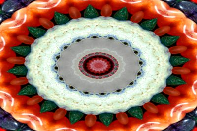

# Kaleidoscope

A [frei0r](https://frei0r.dyne.org "frei0r") plugin and library to produce a kaleidoscope effect on an image or video frame.


| ["Colorful Stones"](https://www.flickr.com/photos/82955120@N05/7995277667 "Colorful Stones") by ["Bold Frontiers"](https://www.flickr.com/photos/82955120@N05 "Bold Frontiers") | `kimg -s 16 -c tr` |
| - | - |
| [](images/colorful_stones.jpg)  | [](images/colorful_stones-tr16.jpg)  |
|Licensed under [CC BY 2.0](https://creativecommons.org/licenses/by/2.0/?ref=ccsearch&atype=html "CC BY 2.0") | Segmentation 16, source segment centred to top right|

Allows for specification of number of segments (mirrors), auto selection of optimal source reflection segment, placement of origin and much more!

# Build

Builds with cmake. All dependencies are included. Makes use of Tolga Mizrak and Julien Pommier's trig functions for 
SSE2: [sse_mathfun_extension](https://github.com/to-miz/sse_mathfun_extension "sse_mathfn_extension").

## GNU / Linux

```
$ git clone https://github.com/gbendy/kaleidoscope.git
$ mkdir kbuild
$ cd kbuild
$ cmake -DCMAKE_BUILD_TYPE=Release ../kaleidoscope
$ make
$ make install
```

## Windows

```
$ git clone https://github.com/gbendy/kaleidoscope.git
$ mkdir kbuild-win
$ cd kbuild-win
$ cmake -G "Visual Studio 16 2019" ../kaleidoscope
```

Then open the solution in Visual Studio 2019.

## Custom build options

There is only one build option `-DUSE_REFLECTION`. When enabled then actual reflections will be calculated rather than reflection by rotation. This can be quicker for lower segmentation values but slower for larger. The default rotation method is constant speed regardless of segmentation.

# Contributors

This project exists thanks to all the people who contribute.

- [Brendan Hack](https://github.com/gbendy "Brendan Hack")
- [Spaceman Paul](https://github.com/SpacemanPaul "Spaceman Paul")
